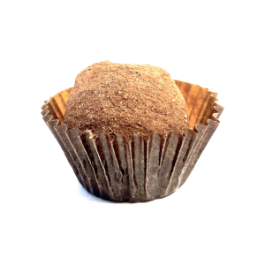

# Swiss Schöggeli

Finest Swiss milk chocolate containing [Wybrand](https://wybrand.ch/) (brandy)
made through sustainable upcycling.

## Ingredients

* 63x Milk chocolate praliné hollow shells (26mm diameter)

**Filling**

* 95g Winebarrel Wybrand (brandy)
* 25g Water
* 85g Whole cream
* 265g Milk chocolcate
* Piping bag for filling

**Closing Lid**

* 100g Milk chocolcate

**Decoration**

* 200g Milk chocolcate
* Chocolate powder

## Steps

* Put the whole cream into a pan, set it to low heat

* Cut the milk chocolate into smaller pieces and put it into the pan

* Stir it to ensure the chocolate melts slowly and completely

* Once fully melted, wait until the mix has room temperature to ensure it is
  not too hot
  - Mix in the brandy and water, give it a quick stir
  - Pour the filling into a piping bag and evenly fill the chocolate shells
  - Leave a little room to later on add the chocolate lid on top

* Store the filled shells at room temperature to ensure the filling hardens

* Melt the milk chocolate for the lids in a pan over a water bath

* Pour the melted chocolate into a clean piping bag and use it to close all
  shell openings

* Again, wait until the chocolate lids have hardened

* Melt the milk chocolate for the decoration in a pan over a water bath

* Pour the chocolate powder in a separate bowl and have another empty bowl at
  hand to place the decorated pralinés in

* Wash your hands and cover your palms with the melted chocolate
  - Take a few pralinés into your hands and make sure they are evenly coated
    with the melted chocolate
  - Quickly place them into the bowl with the chocolate powder
  - Shake the bowl to coat the pralinés evenly

* Wait a few minutes until the coating has fully dried up and place them in the
  empty and clean bowl

* Once all pralinés have been processed store them in an airtight box at room
  temperature

* Enjoy!
